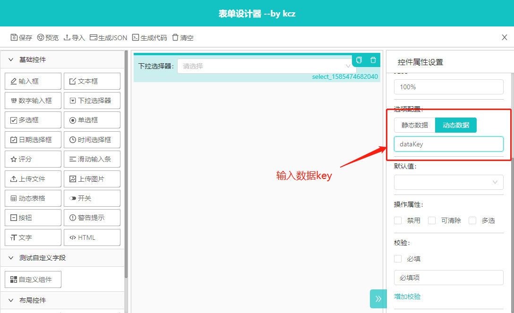

# k-form-build
## 介绍
表单构建组件，将表单设计器生成的json数据构建成表单

## 基础用法


```  html
<template>
  <div>
    <k-form-build :value="jsonData" />
  </div>
</template>
<script>
export default {
  data () {
    return {
      jsonData: {
        list: [
          {
            type: 'input',
            label: '单行文本',
            options: {
              width: '100%',
              defaultValue: '',
              placeholder: '请输入',
              disabled: false
            },
            model: 'input_1577875678405',
            key: 'input_1577875678405',
            rules: [{ required: true, message: '必填项' }]
          },
          {
            type: 'date',
            label: '日期选择器',
            options: {
              width: '100%',
              defaultValue: '',
              range: false,
              showTime: false,
              disabled: false,
              clearable: false,
              placeholder: '请选择',
              rangePlaceholder: ['开始时间', '结束时间'],
              format: 'YYYY-MM-DD'
            },
            model: 'date_1577877450971',
            key: 'date_1577877450971',
            rules: [{ required: true, message: '必填项' }]
          },
          {
            type: 'textarea',
            label: '多行文本',
            options: {
              width: '100%',
              minRows: 4,
              maxRows: 6,
              defaultValue: '',
              disabled: false,
              placeholder: '请输入'
            },
            model: 'textarea_1577877446659',
            key: 'textarea_1577877446659',
            rules: [{ required: true, message: '必填项' }]
          },
          {
            type: 'rate',
            label: '评分',
            options: {
              defaultValue: 0,
              max: 5,
              disabled: false,
              allowHalf: false
            },
            model: 'rate_1577877468717',
            key: 'rate_1577877468717',
            rules: [{ required: true, message: '必填项' }]
          }
        ],
        config: {
          layout: 'horizontal',
          labelCol: { span: 4 },
          wrapperCol: { span: 18 },
          hideRequiredMark: false,
          customStyle: ''
        }
      }
    }
  }
}
</script>
```

## 使用getData函数获取数据

[filelabel](./form-build1.html ':include :type=iframe width=100% height=320px')

```  html
<template>
  <div>
    <k-form-build ref="kfb" :value="jsonData" />
    <button @click="handleGetData">获取数据</button>
  </div>
</template>
<script>
export default {
  data () {
    return {
      jsonData: {
        list: [
          {
            type: 'input',
            label: '单行文本',
            options: {
              width: '100%',
              defaultValue: '',
              placeholder: '请输入',
              disabled: false
            },
            model: 'input_1577875678405',
            key: 'input_1577875678405',
            rules: [{ required: true, message: '必填项' }]
          },
          {
            type: 'date',
            label: '日期选择器',
            options: {
              width: '100%',
              defaultValue: '',
              range: false,
              showTime: false,
              disabled: false,
              clearable: false,
              placeholder: '请选择',
              rangePlaceholder: ['开始时间', '结束时间'],
              format: 'YYYY-MM-DD'
            },
            model: 'date_1577877450971',
            key: 'date_1577877450971',
            rules: [{ required: true, message: '必填项' }]
          },
          {
            type: 'textarea',
            label: '多行文本',
            options: {
              width: '100%',
              minRows: 4,
              maxRows: 6,
              defaultValue: '',
              disabled: false,
              placeholder: '请输入'
            },
            model: 'textarea_1577877446659',
            key: 'textarea_1577877446659',
            rules: [{ required: true, message: '必填项' }]
          },
          {
            type: 'rate',
            label: '评分',
            options: {
              defaultValue: 0,
              max: 5,
              disabled: false,
              allowHalf: false
            },
            model: 'rate_1577877468717',
            key: 'rate_1577877468717',
            rules: [{ required: true, message: '必填项' }]
          }
        ],
        config: {
          layout: 'horizontal',
          labelCol: { span: 4 },
          wrapperCol: { span: 18 },
          hideRequiredMark: false,
          customStyle: ''
        }
      }
    }
  },
  methods: {
    handleGetData () {
      // 使用getData函数获取数据
      this.$refs.kfb.getData().then(values => {
        console.log('验证通过', values)
      }).catch(() => {
        console.log('验证未通过，获取失败')
      })
    }
  }
}
</script>
```

## 通过提交按钮触发submit事件


```  html
<template>
  <div>
    <k-form-build @submit="submitData" :value="jsonData" />
  </div>
</template>
<script>
export default {
  data () {
    return {
      jsonData: {
        list: [
          {
            type: 'input',
            label: '单行文本',
            options: {
              width: '100%',
              defaultValue: '',
              placeholder: '请输入',
              disabled: false
            },
            model: 'input_1577875678405',
            key: 'input_1577875678405',
            rules: [{ required: true, message: '必填项' }]
          },
          {
            type: 'button',
            label: '提交',
            options: { type: 'primary', handle: 'submit', disabled: false },
            key: 'button_1577880512173'
          }
        ],
        config: {
          layout: 'horizontal',
          labelCol: { span: 4 },
          wrapperCol: { span: 18 },
          hideRequiredMark: false,
          customStyle: ''
        }
      }
    }
  },
  methods: {
    submitData (getData) {
      getData()
        .then(values => {
          console.log('验证通过', values)
        })
        .catch(() => {
          console.log('验证未通过，获取失败')
        })
    }
  }
}
</script>
```

## 动态数据配置

> 设计时需要选择动态数据绑定数据key



> 使用dynamicData属性传入


> 代码示例

```html
<template>
  <div>
    <k-form-build
      :value="jsonData"
      :dynamicData="dynamicData"
      ref="KFB"
      @submit="handleSubmit"
    />
    <button @click="getData">提交</button>
  </div>
</template>
<script>
export default {
  name: "Demo",
  data() {
    return {
      dynamicData: {
        dataKey: [
          {
            label: "动态数据1",
            value: 1
          },
          {
            label: "动态数据2",
            value: 2
          },
          {
            label: "动态数据3",
            value: 3
          }
        ]
      },
      jsonData: {
        list: [
          {
            type: "select",
            label: "下拉选择器",
            options: {
              width: "100%",
              multiple: false,
              disabled: false,
              clearable: false,
              placeholder: "请选择",
              dynamicKey: "dataKey",
              dynamic: true,
              options: [
                { value: "1", label: "下拉框1" },
                { value: "2", label: "下拉框2" }
              ],
              filterable: false
            },
            model: "select_1585474682040",
            key: "select_1585474682040",
            rules: [{ required: false, message: "必填项" }]
          }
        ],
        config: {
          layout: "horizontal",
          labelCol: { span: 4 },
          wrapperCol: { span: 18 },
          hideRequiredMark: false,
          customStyle: ""
        }
      }
    };
  },
  methods: {
    handleSubmit(p) {
      // 通过表单提交按钮触发，获取promise对象
      p()
        .then(res => {
          // 获取数据成功
          alert(JSON.stringify(res));
        })
        .catch(err => {
          console.log(err, "校验失败");
        });
    },
    getData() {
      // 通过函数获取数据
      this.$refs.KFB.getData()
        .then(res => {
          // 获取数据成功
          alert(JSON.stringify(res));
        })
        .catch(err => {
          console.log(err, "校验失败");
        });
    }
  }
};
</script>
```


## API
<table>
    <thead>
      <tr>
        <th>参数</th>
        <th>说明</th>
        <th>类型</th>
        <th>默认值</th>
        <th>版本</th>
      </tr>
    </thead>
    <tbody>
      <tr>
        <td>value</td>
        <td>表单设计器生成的json数据</td>
        <td>json</td>
        <td>-</td>
        <td></td>
      </tr>
        <tr>
        <td>dynamicData</td>
        <td>选项控件的动态配置数据</td>
        <td>json</td>
        <td>{}</td>
        <td>3.3.0</td>
      </tr>
        </tr>
        <tr>
        <td>disabled</td>
        <td>禁用所有输入控件</td>
        <td>boolean</td>
        <td>false</td>
        <td>3.3.0</td>
      </tr>
    </tbody>
  </table>


## 函数
  <table>
    <thead>
      <tr>
        <th>函数名称</th>
        <th>说明</th>
        <th>参数</th>
        <th>回调参数</th>
      </tr>
    </thead>
    <tbody>
     <tr>
        <td>getData</td>
        <td>获取表单数据，返回Promise对象，判断验证是否通过</td>
        <td>-</td>
        <td>Promise</td>
      </tr>
         <tr>
        <td>handleReset</td>
        <td>重置表单</td>
        <td>-</td>
        <td>void</td>
      </tr>
    </tbody>
  </table>


## 事件
  <table>
    <thead>
      <tr>
        <th>事件名称</th>
        <th>说明</th>
        <th>回调参数</th>
      </tr>
    </thead>
    <tbody>
      <tr>
        <td>submit</td>
        <td>点击提交按钮触发，也可以通过getData函数获取数据</td>
        <td>Promise对象</td>
      </tr>
    </tbody>
  </table>

